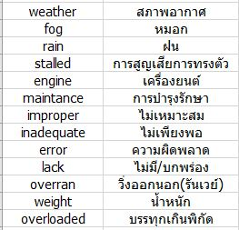

## คำอธิบายโปรเจค

* โปรเจคนี้มีจุดประสงค์เพื่อการศึกษาในการวิเคราะห์ข้อมูลการเกิดอุบัติเหตุของเครื่องบินแต่ละชนิด เพื่อหาสถิติ   การเกิดอุบัติเหตุโดยวิเคราะห์จากปัจจัยต่างๆ อาทิ สภาพอากาศ ปัจจัยทางกายภาพ ประเภทของเครื่องบิน และแสดงสถิติความเสียหายของอุบัติเหตุว่ามากน้อยเพียงใด โดยคำนวณจากข้อมูลกว่า 3000 ครั้งโดยประมาณ   
ตั้งแต่ปี พ.ศ.2513 (ค.ศ. 1970) จนถึงปี พ.ศ.2559 (ค.ศ. 2016) รวมระยะเวลากว่า 46 ปี โดยเลือกใช้ภาษา   
python ในการเขียนโปรแกรมคำนวณ

## ใช้ข้อมูลจากไหน ?
  ข้อมูลจาก  
  * https://www.kaggle.com/saurograndi/airplane-crashes-since-1908
  * http://www.planecrashinfo.com/  

รูปแบบข้อมูล : ไฟล์ข้อมูลนามสกุล .csv ซึ่งประกอบด้วย  
  * Date : วันที่เกิด
  * Time : เวลาที่เกิด
  * Location : สถานที่เกิด ระบุเป็นเมืองและประเทศ
  * Type : โมเดลหรือรุ่นของตัวเครื่องบิน ระบุทั้งตระกูลและรุ่นย่อย
  * Flight : หมายเลขเที่ยวบิน
  * Aboard : จำนวนผู้โดยสารทั้งหมด รวมทั้งลูกเรือ
  * Fatalities : จำนวนผู้เสียชีวิตที่โดยสารมาพร้อมกับเที่ยวบิน
  * Ground : จำนวนผู้เสียชีวิตบนภาคพื้น
  * Summary : สรุปข้อมูลอุบัติเหตุ เป็นข้อความที่กล่าวถึงชนิดของเครื่องบิน และเหตุที่ก่อให้เกิดอุบัติเหตุ

หมายเหตุ
 * จาก Dataset เลือกใช้ช่วงเวลา 1970 เป็นต้นมาเพราะในก่อนหน้านี้มีสงครามโลกครั้งที่ 1 และ 2 ซึ่งอาจเกิดความคลาดเคลื่อนของข้อมูลได้สูงมาก เนื่องด้วยเครื่องบินในยุคนั้นโดยส่วนมากผลิตเพื่อใช้ในสงครามมากกว่าที่จะใช้ขนส่ง  และตั้งแต่ปี 1970 เป็นต้นมา เครื่องบินที่ใช้เครื่องยนต์ไอพ่นเริ่มได้รับการพัฒนาขึ้น  ซึ่งก่อนหน้านี้จะใช้เป็นใบพัดทั้งหมด  

### สถิติการเกิดอุบัติเหตุโดยเรียงตามปี
<embed type="image/svg+xml" src="https://cdn.rawgit.com/158Alfetta/dfb7247e061c3d71e8a964758b1e099a/raw/2800242367f1f13464e393e6e9fb942afd9ce482/(c)bar_vertical_year.svg"  align="center" />  
  
#### อธิบาย
  * จากกราฟพบว่าแนวโน้มของการเกิดอุบัติเหตุนั้นน้อยลง สังเกตได้จากในช่วงแรกๆ ไม่มีปีใดเลยที่มีอุบัติเหตุน้อยกว่า 60 ครั้งต่อปี หลังปี 2004 จึงเริ่มลดลงมา
  * หากมองเป็นทศวรรษ จะพบว่าในช่วง 70s จะเยอะที่สุด ทศวรรษถัดไปในปี 1980-1987 มีเหตุน้อยกว่าช่วงทศวรรษแรก และเริ่มเยอะขึ้นอีกครั้งในปี 1988-1989
  ช่วง 90s ภาพรวมเยอะกว่าทศวรรษที่แล้ว และหลัง ปี 2000 อุบัติเหตุมีแนวโน้มลดน้อยลง เนื่องมาจากเทคโนโลยีการบินที่มีความปลอดภัยมากขึ้น เพราะเครื่องบนในช่วงแรกที่ให้บริการในยุคแรกนั้นเริ่มปลดระวางแล้ว และเปลี่ยนเครื่องใหม่ (โดยปกติเครื่องบินจะทำการบินประมาณ 20-30 ปี ถึงจะปลดระวาง ในระหว่างนั้นก็บำรุงรักษาตามมาตรฐาน) ซึ่งพอดีกับเวลาที่เครื่องบินไอพ่นในยุคแรกเริ่มปลด
  * ปีที่เกิดเหตุเยอะที่สุดคือ 1972 และรองลงมาคือ 1989  
  
#### เกิดอะไรขึ้นในปี 1972 ?
  * จากการค้นหาข้อมูลพบว่าในปี 1972 นั้น ในปีดังกล่าวถือว่าเป็นปีที่ก้าวกระโดดของเครื่องบินแบบโดยสาร เพราะมีหลายสายการบินเริ่มเปิดให้บริการ อาทิ สายการบิน Aeroflot
  และอยู่ในช่วงปลายของสงครามเวียดนาม (จบลงในปี 1975) ซึ่งทำการรบอย่างดุเดือด เครื่องบินในยุคนี้เริ่มเปลี่ยนเป็นไอพ่น

ตารางแสดงจำนวนรุ่นเครื่องบิน 10 รุ่นทีเกิดอุบัติเหตุสูงในปี 1972

* พบว่า 4 ใน 10 เป็นเครื่องบินทหารที่ทำการรบ อีก 2 รุ่นเป็นเครื่องบินไอพ่น ซึ่งเป็นเทคโนโลยีใหม่ของสมัยนั้น ดูจากรุ่น DC-9 จะเห็นว่าเปิดตัวมาเพียง 7 ปี แล้วในปี 1972
เพียงปีเดียวเกิดอุบัติเหตุถึง 4 ครั้ง ซึ่ง DC-9 เป็นเครื่องบินโดยสารขนาดกลาง มีผู้โดยสารเยอะ เมื่อเกิดอุบัติเหตุก็ทำให้ตัวเลขผู้เสียชีวิตสูงด้วยเช่นกัน
* การเกิดอุบัติเหตุมีด้วยกันหลายปัจจัย ในที่นี้ไม่ได้หมายถึงว่ารุ่น DC-9 ถูกผลิตออกมาอย่างไม่ได้คุณภาพ เพราะเมื่อเครื่องบินเกิดเหตุแต่ละครั้งก็จะมีการเก็บข้อมูลโดยบริษัท เพื่อแก้ไขจุดบกพร่องของรุ่น จึงแสดงให้เห็นว่าในช่วงปีหลังๆ นั้น การที่อุบัติเหตุทางเครื่องบินลดน้อยลงก็อาจเป็นเพราะการพัฒนาของเทคโนโลยี ที่เกิดขึ้นจากการแก้ไขจุดบกพร่องในอดีต

#### กราฟเส้นแสดงอัตราผู้เสียชัวิต โดยเรียงตามปี 
_____________________________________________________________________________________________________

<embed type="image/svg+xml" src="https://cdn.rawgit.com/158Alfetta/807efd58fe93168be36663a1addb8c97/raw/ba3a41ec06343c3772da84a4d0c079b1eaedce3b/(c)fatal_line.svg"  align="center" />  

#### อธิบาย
  * ทั้งแผนภูมิสถิติที่เกิดอุบัติเหตุและกราฟเส้นของผู้เสียชีวิตสอดคล้องกัน กล่าวคือ เกิดเหตุหลายครั้ง ผู้เสียชีวิตก็มีจำนวนที่เยอะ ในกราฟนี้ปี 1972 ก็มีจำนวนผู้เสียชีวิตเยอะที่สุด
  สอดคล้องกับแผนภูมิด้านบน
  * พบข้อสังเกตุในปี 2013 และปี 2014 ที่มีอุบัติเหตุเท่ากันคือ 33 ครั้ง แต่ผู้เสียชีวิตของปี 2013 คือ 341 ราย ในขณะที่ปี 2014 มีสูงถึง 1189 ราย

<embed type="image/svg+xml" src="https://cdn.rawgit.com/158Alfetta/077949c34279af865bf36dbd62a4d62c/raw/125d6e4a469c3d296290f3a0633c3683d3d95b56/operate2_line.svg"  align="center" />  
  มองลึกไปถึงประเภทเครื่องบิน ในปี 2013 และปี 2014 มีเครื่องบินโดยสารตกเท่ากันคือ 26 ลำ และเครื่องบินประเภทอื่นไม่แตกต่างกันมาก 
 จึงหาข้อมูลใน dataset พบว่าในปี 2014 มีเหตุการณ์ทางการบินที่รุนแรงและมีผู้เสียชีวิตเป็นจำนวนมาก 3 ครั้ง  
 

  
  * แสดงให้เหตุว่า ในข้อสันนิษฐานแรกนั้น ไม่เป็นเสมอไป เพราะในเครื่องบินบางลำนั้นอาจเป็นเครื่องบินโดยสารขนาดใหญ่ ซึ่งมีผู้โดยสารเยอะ เช่น ในปี 2013 มีอุบัติเหตุเยอะแต่
ผู้โดยสารส่วนใหญ่น้อย หรืออาจจะเป็นเครื่องบินขนาดเล็ก พิสัยใกล้ เป็นต้น

### สถิติแสดงการเกิดอุบัติเหตุที่ส่งผลกระทบต่อผู้คนภาคพื้น
* แสดงเหตุการณ์ที่มีผู้เสียชีวิตที่อยู่บนภาคพื้น (Ground) เพราะโดยปกติแล้วเครื่องบินโดยส่วนใหญ่จะเกิดอุบัติเหตุบริเวณที่ไม่ใช่เขตเมือง หรือบริเวณจุดที่มีผู้คนอาศัยอยู่ เนื่องด้วยนักบินถูกฝึกให้หลีกเลี่ยงการเกิดอุบัติเหตุในลักษณะดังกล่าว เพื่อให้เกิดความเสียหายน้อยที่สุด ถ้าเหตุการณ์ใดนั้นมีผู้เสียชีวิตภาคพื้นมาก อาจสันนิษฐานได้ว่าเหตุการณ์นั้น อาจตกในบริเวณที่มีผู้คนอาศัยอยู่ หรือเขตเมือง

โดยแผนภูมินี้จะแสดงสถิติผู้เสียชีวิตที่อยู่ภาคพื้น โดยเรียงตามจำนวนของผู้เสียชีวิต(ไม่รวมบนเครื่อง)   จะมาวิเคราะห์กันว่า ในเหตุการณ์ส่วนใหญ่นั้น มีอะไรเกิดขึ้น ที่ทำให้เครืองบินลำนั้นส่งผลต่อผู้คนภาคพื้น

<embed type="image/svg+xml" src="https://cdn.rawgit.com/158Alfetta/52179aa4041b87355c2c10cc8fc39a36/raw/f0bbfde956a5fbaa612e335e8e409a99521953e9/(c)ground.svg
" />  

#### อธิบาย
* จากแผนภูมิ แท่งที่ 1 และ แท่งที่ 2 มีการกระโดดของข้อมูลที่สูงมาก โดยทั้ง แท่งที่ 1, 2 และ 4 นั้นเกิดขึ้นในเหตุการณ์ 9/11 ซึ่งทั้งสามลำนั้นถูก Hijack หรือถูกปล้น
แล้วจงใจก่อวินาศกรรม ส่งผลให้มีผู้เสียชีวิตเป็นจำนวนมาก  
* ทางกลุ่มจึงตั้งสมมุติฐานว่า ในแผนภูมิแท่งดังกล่าวต้องมีหลายเหตุการณ์ที่เกิดขึ้นเพราะถูก Hijack เพราะเชื่อว่าการที่ส่งผลต่อคนภาคพื้นเป็นจำนวนมากๆ นั้นเกิดขึ้นเพราะการจงใจ

จึงได้ทำการพลอตแผนภูมิใหม่ขึ้นมาโดยใช้ code ภาษา Python ค้นหาคำเฉพาะหรือคำที่น่าจะบอกสาเหตุใน Summary และเก็บค่าไว้ โดยแบ่งประเภทดังนี้
  * Hijack : 'hijack' = การถูกปล้น
  * Attempt to takeoff or landing : 'take off', 'takeoff', 'landing' = เครื่องเกิดอุบัติเหตุเพราะพยายามที่จะนำเครื่องขึ้นบิน หรือนำเครื่องลงจอด
  * Suicide : 'suicide' = เหตุที่เกิดขึ้นเพราะการฆ่าตัวตาย(ของลูกเรือหรือนักบินเอง)
  * Shot down : 'shot' = ถูกยิงเครื่องบินขณะทำการบิน
  * Other : เหตุการณ์อื่นๆ ที่นอกเหนือจากการสันนิษฐาน

<embed type="image/svg+xml" src="https://cdn.rawgit.com/158Alfetta/030aea455f9f7519aca745a50ab5c096/raw/7d2407adc2cfed38eef27a8e5a18b642afb5ae42/Ground_keyword.svg" />  

* ผลลัพท์ออกไม่ตรงตามที่สันนิษฐานไว้ เพราะ Hijack มีเพียง 3 ครั้ง ซึ่งหมายความว่าทั้ง 3 ครั้งเกิดขึ้นเพราะเหตุการณ์ 9/11
* จึงสรุปได้ว่า การเกิดอุบัติเหตุที่ส่งผลต่อผู้คนภาคพื้นดินนั้นส่วนใหญ่เกิดขึ้นเพราะเหตุสุดวิสัยขณะทำการบิน แทนที่จะเกิดขึ้นเพราะความตั้งใจของนักบินหรือผู้ก่อการร้ายก็ตาม
เช่นเหตุการณ์ในแผนภูมิแรก แท่งที่ 3 เกิดขึ้นเพราะเครื่องบินออกนอกรันเวย์ไปชนกันย่านการค้า ในขณะที่พยายามจะนำเครื่องขึ้นบิน

### แผนที่แสดงอุบัติเหตุที่เกิดขึ้นในประเทศต่างๆ แสดงเป็นจำนวนครั้ง
* ใน Dataset มีการระบุถึงสถานที่เกิด จึงนำมาพลอตเพื่อหาว่าอุบัติเหตุโดยส่วนใหญ่มักจะเกิดขึ้นที่ไหน

<embed type="image/svg+xml" src="https://cdn.rawgit.com/158Alfetta/941b94cbd93b85cf6bc9a25f2569d056/raw/9703783517fdcb2f822cf73d726fa04296543383/maps2.svg"  />  

* จากแผนที่พบว่าประเทศที่เกิดเหตุเยอะที่สุดคือ สหรัฐอเมริกา รองลงมาเป็นประเทศรัสเซีย ทั้งสองประเทศเป็นประเทศที่ผลิตเครื่องบินอันดับต้นๆ ของโลก มีเครื่องบินหลายรุ่นถูกผลิตที่สหรัฐและรัสเซีย และสหรัฐ มีการจราจรทางอากาศหนาแน่นที่สุดในโลก 

### แล้วเครื่องบินแบบไหนเกิดอุบัติเหตุบ่อย ?
* จากข้อมูลที่ได้มา มีการบันทึกถึงรุ่นของเครื่องบินด้วย แต่หากจะอธิบายว่าเครื่องบินรุ่นนี้เกิดอุบัติเหตุบ่อยนั้น ก็อาจจะดูไม่เหมาะสมสักเท่าไร เพราะว่าหากเครื่องบินรุ่นนี้มีการผลิตเยอะ หมายความว่าการเกิดอุบัติเหตุก็สูงขึ้นได้ด้วยเช่นกัน ดังนั้น จึงต้องมาเทียบกับยอดการผลิตของเครื่องบิน
* เนื่องจากมีรุ่นเครื่องบินมากมาย บางรุ่นอาจผลิตน้อยมาก และเกิดอุบัติเหตุน้อย จึงยกข้อมูลมาเพียง 10 อันดับแรก

#### แผนภูมิแที่ 1 แสดงอัตราการเกิดอุบัติเหตุของรุ่นเครื่องบิน 10 อันดับแรก โดยเรียงตามจำนวนครั้งที่เกิด
<embed type="image/svg+xml" src="https://cdn.rawgit.com/158Alfetta/cfceaff354c9cc332454c47847d208fd/raw/039fe36b6e49cb2fd5d9df67ddd4431ca5c14b2f/(c)model.svg"  />  
_____________________________________________________________________________________________________

#### แผนภูมิแสดงอัตราร้อยละ เมื่อนำข้อมูลจากตารางที่ 1 มาเทียบกับยอดการผลิตของเครื่องบินแต่ละรุ่น  

<embed type="image/svg+xml" src="https://cdn.rawgit.com/158Alfetta/f19a57c622807451acd8babcdfd38806/raw/9e5d6c2509f4e1b3847442c98d69a06a71f23922/(c)Percent_model.svg" />  

* จากเครืองบินทั้งหมด 10 รุ่นนั้น มีเพียงรุ่นเดียวเท่านั้นที่ใช้ไอพ่นในการขับเคลื่อน เพราะเครื่องยนต์ใบพัดต้นทุนถูกกว่า นิยมใช้กับเครื่องบินขนาดเล็กที่แพร่หลายมากกว่า
และมีเครื่องบินขนาดกลาง 4 รุ่น จาก 10 รุ่น
* จากแผนภูมิแท่งแสดง Percent นั้นพบว่ามีเครื่องบินที่มีค่า Percent ที่สูงโดนจากรุ่นอื่น 3 รุ่น
  * de Havilland Canada DHC-6 : เครื่องบินที่มีขนาดเล็กมาก 2 ที่นั่ง และเล็กที่สุดใน 10 รุ่นในแผนภูมิ ส่วนมากใช้สำหรับการฝึกบิน จึงอาจจะมีอุบัติเหตุสูงกว่ารุ่นอื่นมาก
  * Douglas DC-3 และ Fokker F-27 : ทั้งสองรุ่นเป็นเครื่องบินที่พิกัดเดียวกัน และถูกนำไปใช้ในทางทหารด้วยบางส่วนเช่นเดียวกัน จึงทำให้ทั้งสองลำนี้มีเปอร์เซ็นต์ที่สูงกว่ารุ่นอื่นๆ 
* หากไม่มองถึงปัจจัยทางกายภาพอื่นๆ เช่นสภาพอากาศ ก็จะสรุปได้ว่าเครื่องบินขนาดเล็กมีการใช้งานอย่างแพร่หลาย นักบินไม่ต้องมีประสบการณ์มากนัก และถูกนำไปใช้งานหลายประเภทมากกว่า ทั้งเครื่องบินส่วนบุคคล, เครื่องบินฝึกหัด, เครื่องบินโดยสาร(Taxi) และใช้ในทางทหาร จึงทำให้มีความน่าจะเป็นที่จะเกิดอุบัติเหตุเยอะกว่าเครื่องบินขนาดใหญ่ที่นำไปใช้เฉพาะทาง และนักบินต้องมีประสบการณ์ที่สูงกว่า

______________________________________________________________________________________________________________
## ปัจจัยที่ส่งผลต่อการเกิดอุบัติเหตุ

### แผนภูมิแสดงสถานะของเครื่องบินเมื่อเกิดอุบัติเหตุ
* วิเคราะห์ว่าโดยส่วนใหญ่แล้วเครื่องบินจะเกิดอุบัติเหตุเมื่อใด โดยมี 3 สถานะ คือ  
1.ขณะนำเครื่องขึ้นบิน (Take off)  
2.ขณะทำการบิน (On-Flight)  
3.ขณะนำเครื่องลงสู่ท่าอากาศยาน (Landing)

<embed type="image/svg+xml" src="https://cdn.rawgit.com/158Alfetta/03139e0c8111817079c0f4fbe2174e14/raw/509f11dfeeee7552500865fe492e9be62393e2ae/status_bar_chart.svg" />

* ซึ่งแน่นอนอยู่แล้วว่าการเกิดอุบัติเหตุจะต้องเกิดระหว่างทำการบินไปแล้ว สิ่งที่น่าสนใจคือระหว่างการนำเครื่องลง หรือ Landing นั้นเกิดอุบัติเหตุมากกว่านำเครื่องขึ้นบิน(take off)
ดังนั้นเราจะมาหาสาเหตุกันว่าเป็นเพราะอะไร

#### แผนภูมิแสดงคำที่ถูกใช้มากที่สุดใน Summary ของอุบัติเหตุทั้งหมดที่เกิดขึ้นขณะ Landing/Take off
* แผนภูมินี้ได้จากการหาคำที่ถูกใช้มากที่สุด เป็นคำเฉพาะที่บ่งบอกถึงสาเหตุเท่านั้น โดยทางกลุ่มได้ค้นหาคำที่ถูกใช้มากกว่า 10 คำขึ้นไป เพื่อให้สามารถเปรียนเทียบกันได้

<embed type="image/svg+xml" src="https://cdn.rawgit.com/158Alfetta/79456fe2965bd5e00f23430c8cc9734d/raw/4d4f44ed7035e24b18f4c6305e05ffda23aa30ab/land_take_word.svg" />

* จากกราฟ คำที่สูงที่สุดในนี้คือ 'engine' ทั้งสองสถานะ ซึ่งเกี่ยวกับเครื่องยนต์ และแตกต่างกันในบางคำ แต่ส่วนใหญ่แล้วค่อนข้างใกล้เคียงกัน

### แผนภูมิแสดงประเภทของหนึ่งในสาเหตุที่ส่งผลต่อการเกิดอุบัติเหตุ
* การเกิดอุบัติเหตุนั้นมีหลักหลายสาเหตุด้วยกัน โดยแผนภูมิทำขึ้นจากการค้นหาคำเฉพาะและเก็บค่าเอาไว้ เนื่องจากมีหลายคำที่ถูกใช้ และพยายามให้ครอบคลุมมากที่สุด ทางกลุ่มจึงแบ่งเป็นหมวดหมู่ เป็น 8 กลุ่มด้วยกัน ดังนี้
  * Weather : สภาพอากาศ อาทิ ฝนตก(rain), หิมะ(snow), พายุ(storm)
  * Mechanism : ที่เกี่ยวกับเครื่องยนกลไกทุกประเภท อาทิ ปีก(wing), เครื่องยนต์(engine)
  * Geography : สภาพทางภูมิศาสตร์
  * Human error : ที่เกิดจากความผิดพลาดของมนุษย์ เช่น การบำรุงรักษาที่ไม่ถูกต้อง(Improper Maintainance)
  * Attack : การถูกโจมตี เช่น ถูกยิง(shot)
  * Hijack : ถูกปล้น (hijack)
  * Distrub : ถูกสิ่งรบกวน เช่น นก(bird)
  * Suicide : การฆ่าตัวตาย ครอบคลุมถึงการฆ่าตัวตายของลูกเรือและผู้โดยสาร  
  
 ทั้งนี้ในบางเที่ยวบินอาจเกิดขึ้นได้มากกว่า 1 กรณี
  
<embed type="image/svg+xml" src="https://cdn.rawgit.com/158Alfetta/708afa3675fc300b01381d1900af11e4/raw/847acc4b95dbf2e1d10f7dc5c548a8f8d93ac434/(C)bar_class.svg" />

* โดยส่วนใหญ่แล้วเครื่องบินเกิดอุบัติเหตุเพราะสภาพอากาศสูงที่สุด สภาพอากาศส่งผลเป็นอย่างมากในการบิน สามารถส่งผลให้เกิดอุบัติเหตุได้ทุกขณะ ขณะบิน นำเครื่องขึ้น นำเครื่องลง จะส่งผลต่อภาคพื้นดินหรือรันเวย์ก็ได้(ลื่น)

#### แผนภูมิอุบัติเหตุที่เกิดจากสภาอากาศ(Weather) โดยจำแนกตามสภาวะสภาพอากาศ  
* จากแผนภูมิด้านบน สามารถจำแนกได้อีกเป็น 4 กลุ่มย่อยๆ ดังนี้
  * Rain : 'rain', 'raining', 'hail', 'thunder'
  * Fog : 'fog', 'foggy', 'hazy', 'cloudy', 'mist', 'haze'
  * Storm : 'storm', 'thunderstorm', 'gale', 'hurricane', 'tempest', 'windy'
  * Snow : 'snow', 'sleet'

<embed type="image/svg+xml" src="https://cdn.rawgit.com/158Alfetta/3ef9624e7ea93da492d085fa3cc52189/raw/1e8c5cb7cb6012b23dddb4a677d00dcdb1fd8229/(c)weather_chart.svg" />  

## แผนที่โลกแสดงบริเวณที่เกิดอุบัติเหตุจากการถูกโจมตี
* จากแผนภูมิที่แบ่งสาเหตุของการเกิดอุบัติเหตุ มีอยู่ 1 หัวข้อที่น่าสนใจคือ Attack และ Hijack เพราะสาเหตุอื่นๆ นั้นอาจเกิดขึ้นได้จากการบินปกติ แล้วเกิดความผิดพลาดต่างๆ 
ยกเว้นเพียง 2 หัวข้อนี้ที่แม้ว่าเครื่องบินจะสมบูรณ์ นักบินที่มีประสบการณ์สูง แต่ก็เกิดอุบัติเหตุได้

แผนภูมินี้จึงนำข้อมูลในส่วนของ Location และ Attack, Hijack มาวิเคราะห์พื้นที่ที่เกิดเหตุเครื่องบินโดนโจมตี

<embed type="image/svg+xml" src="https://cdn.rawgit.com/158Alfetta/ea23d5686054178c1052882806d93b4b/raw/63a4e5e327f5f61fd42460ac61c492cbb0d4261b/(c)maps_atk.svg" /> 

แสดงให้เห็นว่า ตัวเลขที่สูงที่สุดคือประเทศ Afghanistan 17 ครั้ง ซึ่งจากการหาข้อมูลพบว่าประเทศอัฟกานิสถานนั้นขณะนี้เกิดสงครามกับกลุ่มก่อความไม่สงบอัลกออิดะฮ์และฏอลิบาน
ตั้งแต่ปี 2001 ซึ่งทุกคนคงทราบกันดีอยู่แล้ว แต่ผลลัพท์ที่น่าแปลกใจคือประเทศ Angola ซึ่งเป็นประเทศในทวีปแอฟรีกา ชื่อที่ไม่คุ้นหูเลย และคนรู้จักประเทศนี้ค่อนข้างน้อย มีการเกิดเหตุดังกล่าวรองลงมาจากอัฟกานิสถานคือ 16 ครั้ง!

เกิดอะไรขึ้นกับประเทศ Angola ?
  * พบว่าประเทศแองโกล่ามีสงครามกลางเมือง 'The Angolan Civil War (1975-2002)' ซึ่งส่วนใหญ่เครื่องบินที่ถูกยิงเป็นเครื่องบินทางทหาร แต่มีเครื่องบนิโดยสารบางลำถูกยิงเช่นเดียวกัน โดยที่กลุ่มก่อความไม่สงบเชื่อว่าเป็นเครื่องบินของทหาร สงครามยืดเยื้อกว่า 27 ปี จึงสิ้นสุดในปี 2002
